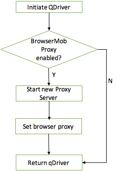

# Manipulating HTTP Request/Response

  

# BrowserMob Proxy

BrowserMob Proxy allows you to manipulate HTTP requests and responses,
capture HTTP content, and export performance data as a [HAR
file](http://www.softwareishard.com/blog/har-12-spec/). BMP works well
as a standalone proxy server, but it is especially useful when embedded
in Selenium tests.

The latest version of BrowserMob Proxy is 2.1.5, powered
by [LittleProxy](https://github.com/adamfisk/LittleProxy).

If you're running BrowserMob Proxy within a Java application or Selenium
test, get started with [Embedded
Mode](https://github.com/lightbody/browsermob-proxy#getting-started-embedded-mode).
If you want to run BMP from the command line as a standalone proxy,
start
with [Standalone](https://github.com/lightbody/browsermob-proxy#getting-started-standalone). 
  

The proxy is programmatically controlled via a REST interface or by
being embedded directly inside Java-based programs and unit tests. It
captures performance data in the [HAR
format](http://groups.google.com/group/http-archive-specification). In
addition it can actually control HTTP traffic, such as:

-   blacklisting and whitelisting certain URL patterns
-   simulating various bandwidth and latency
-   remapping DNS lookups
-   flushing DNS caching
-   controlling DNS and request timeouts
-   automatic BASIC authorisation

  

# Association between QDriver and BrowserMob Proxy

Each proxy server is associated with a QDriver. If
*is\_browser\_mob\_proxy\_enabled* is enabled in test project
configuration, when initiating a new QDriver instance, will launch a new
proxy server in the meantime and dedicate it to be the browser proxy.

The lifecycle of a proxy server is the same as a QDriver instance. Once
the test thread is done or forced to reset by '@reset' tag, proxy server
and driver will be both destructed.

{height="250"}

  

# How to manipulate a HTTP Request/Response

There are four new methods to support request and response interception
in LittleProxy:

-   `addRequestFilter`
-   `addResponseFilter`
-   `addFirstHttpFilterFactory`
-   `addLastHttpFilterFactory`

For most use cases, including inspecting and modifying
requests/responses, `addRequestFilter` and `addResponseFilter`will be
sufficient. The request and response filters are easy to use:

        proxy.addRequestFilter(new RequestFilter() {
                @Override
                public HttpResponse filterRequest(HttpRequest request, HttpMessageContents contents, HttpMessageInfo messageInfo) {
                    if (messageInfo.getOriginalUri().endsWith("/some-endpoint-to-intercept")) {
                        // retrieve the existing message contents as a String or, for binary contents, as a byte[]
                        String messageContents = contents.getTextContents();

                        // do some manipulation of the contents
                        String newContents = messageContents.replaceAll("original-string", "my-modified-string");
                        //[...]

                        // replace the existing content by calling setTextContents() or setBinaryContents()
                        contents.setTextContents(newContents);
                    }

                    // in the request filter, you can return an HttpResponse object to "short-circuit" the request
                    return null;
                }
            });

            // responses are equally as simple:
            proxy.addResponseFilter(new ResponseFilter() {
                @Override
                public void filterResponse(HttpResponse response, HttpMessageContents contents, HttpMessageInfo messageInfo) {
                    if (/*...some filtering criteria...*/) {
                        contents.setTextContents("This message body will appear in all responses!");
                    }
                }
            });

With Java 8, the syntax is even more concise:

            proxy.addResponseFilter((response, contents, messageInfo) -> {
                if (/*...some filtering criteria...*/) {
                    contents.setTextContents("This message body will appear in all responses!");
                }
            });

See the javadoc for the `RequestFilter` and `ResponseFilter` classes for
more information.

For fine-grained control over the request and response lifecycle, you
can add "filter factories" directly
using `addFirstHttpFilterFactory` and `addLastHttpFilterFactory` (see
the examples in the InterceptorTest unit tests).

  

For how to implement code, please refer to BrowserMob-Proxy unit test
cases <https://github.com/lightbody/browsermob-proxy/blob/master/browsermob-core/src/test/java/net/lightbody/bmp/proxy/InterceptorTest.java>  

For how to write BDD test scenarios in Qantas Test Framework, some
examples are
here <https://stash.qcpaws.qantas.com.au/projects/AMS02-A974/repos/qwebauto/browse/src/test/resources/features/HomePage/HttpInterception.feature>

# QMockproxy

Qmockproxy is a library provided in [Qantas Web Automation Test
Framework](Sample_Cucumber-Selenium-Java_Framework). It is implemented
based on BrowserMob Proxy and wrapped into QDriver instance. 

By default, no configuration is required to use qmockproxy. All tests
running against non-prod environments will automatically use qmockproxy
while tests in prod will not use it. The code is as below which means
this configuration can be also force overwritten by provide a true /
false value to is\_mockproxy\_enabled in global.yml or bamboo variable.

``` java
public static final boolean IS_MOCKPROXY_ENABLED = getGlobalConfig("is_mockproxy_enabled")==null ? (ENV.equals(ENVIRONMENTS.PRODUCTION)? false : true) : getGlobalConfig("is_mockproxy_enabled").equalsIgnoreCase("true");
```

  

To interact with embedded qmockproxy to manipulate http request /
response is very similar to BrowserMobProxy.

``` java
qDriver.getMockProxy().addRequestFilter(new RequestFilter() {
    @Override
    public HttpResponse filterRequest(HttpRequest request, HttpMessageContents contents, HttpMessageInfo messageInfo) {
        if(request.getUri().endsWith("media-room/global/en")) {
            request.setUri("https://www.qantas.com/agencyconnect/au/en.html");
        }
        return null;
    }
});
```

Note: Mock proxy is not supported in headless browser. As a result, you
will get an error if enable both headless and mockproxy.

  
This is all you need to know to start to use QMockProxy to extend your
E2E automation test to integration level. All of the rest are taken care
by the test framework, including how to initiate mockproxy instance in
QCP environment and apply upchain proxy as well as teardown when test
finished. You can also check out the source code to explore more for any
interest.

<https://stash.qcpaws.qantas.com.au/projects/AMS02-A974/repos/qwebauto/browse/src/main/java/com/qantas/framework/support/utilities/QMockProxy.java>

  

## Attachments:

{width="8" height="8"}
[image2018-5-14\_10-54-17.png](attachments/119670989/119670990.png)
(image/png)  
{width="8" height="8"}
[image2018-5-14\_10-53-43.png](attachments/119670989/119670991.png)
(image/png)  
