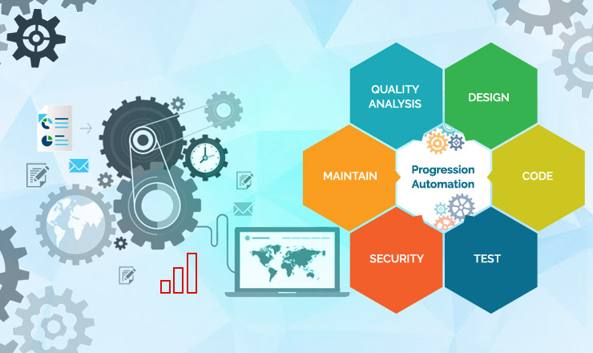

# Qantas Test Automation Playbook

WORK IN PROGRESS

Welcome to Qantas Test Automation Playbook.

Introduction
The purpose of Quality Engineering Automation Playbook is to share the way of the working amongst the various development teams across the Qantas Group. Whilst our default view is to standardise amongst teams, we embrace diversity in thinking and approach.

The Playbook should be thought of as a framework and not a standard. Its a set of principles, practices, idioms, and strategies pertaining to automated software testing and its adoption.

