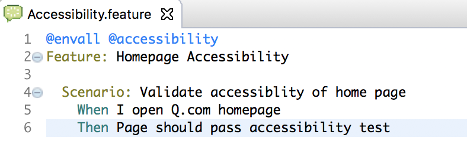
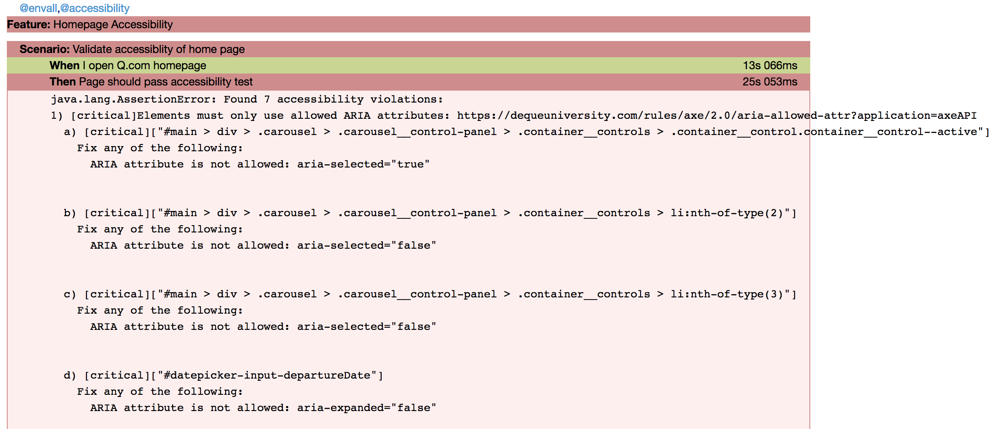
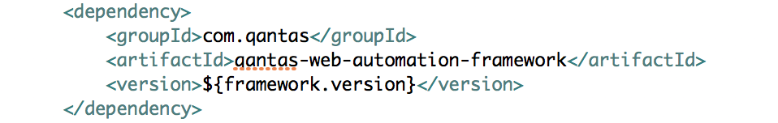

# Automated Accessibility Testing
  

# **What is aXe**

aXe is an automated accessibility testing library which has set out on the road to bring accessibility testing into mainstream web development. The [axe-core](https://github.com/dequelabs/axe-core) library is open source and designed in a way to be used with different testing frameworks, tools, and environments. For example, it can be run in
functional tests, browser plugins or straight in the development version of your application. It currently supports around 55 rules to check a website for various aspects of accessibility. For the advantages of aXe tool and how to use aXe to do manual accessibility test, please checkout this page. [Accessibility Testing](https://confluence.qantas.com.au/display/QQE/Accessibility+Testing)

  

# **Automated Accessibility Test**

aXe provides very strong APIs to validate accessibility of a page or a specific web element. They are all encapsulated into [AxeHelper](https://stash.qcpaws.qantas.com.au/projects/AMS02-A974/repos/qwebauto/browse/src/main/java/com/qantas/framework/support/helpers/AxeHelper.java) in Qantas Accessibility Test Library in [Sample Cucumber-Selenium-Java Framework](Sample_Cucumber-Selenium-Java_Framework).  It provides 2 validate scopes, whole page validation with **validate()** and web element validation with **validate(element)**.

**How to implement your test:**

  
   

 

**What is in test report once test failed**:

# **How to integrate to your existing test project**

-   If your test project is already built on Qantas web automation test framework. Then you can use this feature straight away.
-   If your test project is not using Qantas web automation test framework, please follow below steps:
    1.  If you are using Maven, please add Qantas web automation test framework to your Maven dependency.  
        
        

    2.  If you are using other project tools, please refer to this page [Nexus Usage](https://confluence.qantas.com.au/display/CN/Nexus+Usage) to figure out how to involve the framework.

# **What can be configured for aXe Automation**

Usually different program has different acceptance criteria of accessibility. Test Framework allows user to customise error report levels and indicate compliance standards in configuration file which is
located in _/config/global.yml_

Also it can be overwritten through environment property or bamboo variables according to configuration flexibility described here. [Sample Cucumber-Selenium-Java Framework](Sample_Cucumber-Selenium-Java_Framework) 

