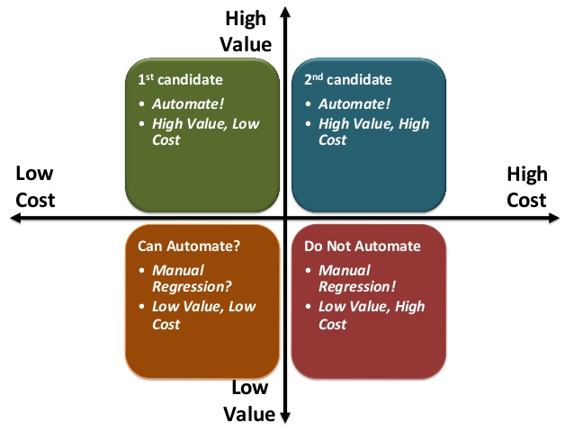

# Automation Return on Investment (ROI)

Test automation has lots of benefits. When analysing the Return on Investment(ROI) for Automation efforts, adhering to the Test Automation Pyramid it is important to consider the cost of automating (or not) and value it brings (cutting execution time and for how long).

As we move higher up the Test Automation Pyramid, the effort becomes more costlier to create and maintain. The diagram below is useful in determining whether automation is likely to provide beneficial ROI or not.

  

The general idea is to try and automate as much as possible which is of high value to the development teams and business.

While there are some [formulae](https://smartbear.com/resources/ebooks/6-ways-to-measure-the-roi-of-automated-testing/) used to calculate hard ROI numbers, the data input required for them can be difficult to determine, they ignore some important considerations and the results can be unrealistic.

Instead the Test Automation ROI should be analysed by value which can be determined by asking a number of questions:

If the answer is 'No' to more than 1 of these questions then maybe it's not worthwhile automating the test case:

-   Do you need to run this test regularly?
-   Is the feature development complete?
-   Is the GUI stable?
-   Is the feature required for legal or financial reasons? 
-   By automating this test will it allow us to release quicker?
-   Will we run the automated test across multiple devices/browsers/environments?
-   Is the time saved by automating this test greater than the time required to write and maintain the test?

### Good candidate example:

Searching for a flight is vital to the business. If this breaks there's huge consequences.

### Bad candidate example:

There's a promo displayed on the home page for a 2 day sale. As this is a short term feature there's a low return on investment.  

Remember, sometimes you can have too much automation. If we spend all of our time on test automation we could end up with some [opportunity cost](https://en.wikipedia.org/wiki/Opportunity_cost). Let's also not forget about the value of manual testing techniques such as [exploratory testing](http://www.satisfice.com/articles/what_is_et.shtml).

