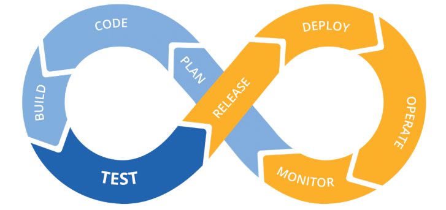
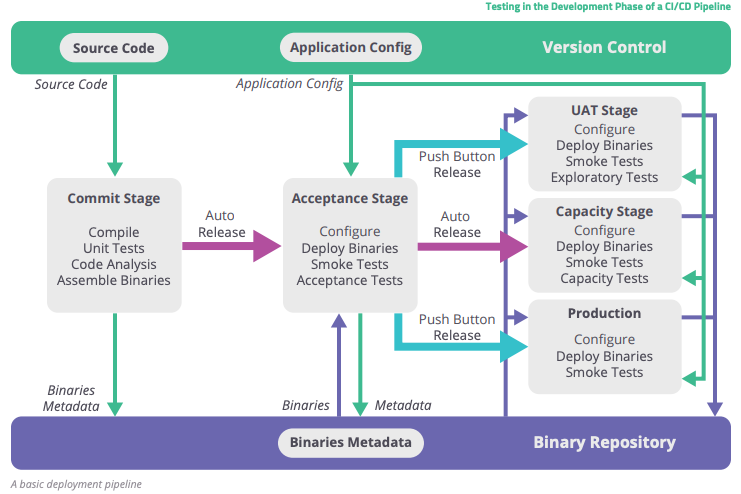
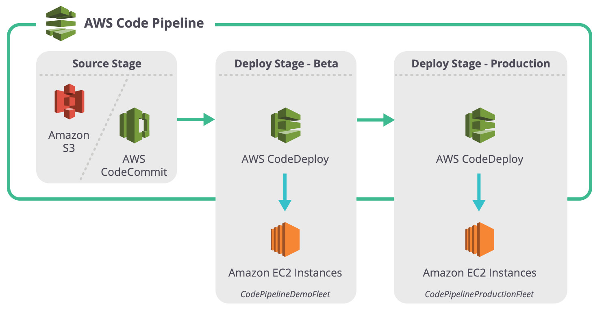

# Continuous Integration / Continuous Delivery

The adoption of CI/CD has changed how developers and testers ship software. This write-up is about this transition to CI/CD pipelines that will provide insights into different tools and process changes which can help developers be more successful. Developer approaches are always changing: long ago, we had Waterfall, then it was Agile, and now it's DevOps. DevOps is how modern developers are building great products. The new methods of Continuous Integration, Continuous Delivery (CI/CD), and Continuous Deployment have come with the rise of DevOps. Conventional software development and delivery methods are rapidly becoming obsolete as deployment frequency increases.

Before DevOps, most companies would deploy/ship software in monthly, quarterly, bi-annual, or even annual releases (also know as the Agile days). In the DevOps era, weekly, daily, and even multiple daily deployments are the norm. With SaaS taking over the development world, one can easily update applications on the fly without forcing customers to download new components. If the CI/CD pipeline is working right, they shouldn’t even realize an update has happened.

Development teams have adapted to the shortened delivery cycles by embracing automation across their software delivery pipeline. Most teams have automated processes to check in code and deploy to new environments. These adaptations have birthed the CI/CD process and have been coupled with a focus on automating the testing process. Lets have a look at what CI/CD is and how modern software companies are using CI/CD tools to automate the process of shipping new code.

#### The Terms

Continuous integration (CI) focuses on blending the software work products of individual developers together into a repository. This can be done several times a day, with the primary purpose being to enable early detection of integration bugs while also allowing for tighter cohesion and more development collaboration.

The aim of Continuous Delivery (CD) is to minimize the friction points that are inherent in the deployment or release processes. Typically, a team's implementation involves automating each of the steps for build deployments so that a safe code release can be done at any moment in time.

Continuous deployment is a higher degree of automation, in which a build/deployment occurs automatically whenever a major change is made to the code.

Each of these stages is part of a deployment (or development) pipeline. In their book Continuous Delivery: Reliable Software Releases through Build, Test, and Deployment Automation, Jez Humble and David Farley explain how every change to the software “goes through a complex process on its way to being released. That process involves building the software, followed by the progress of these builds through multiple stages of testing and deployment. This, in turn, requires collaboration between many individuals and possibly several teams. The deployment pipeline is a model of this process, and its incarnation in a continuous integration and release management tool is what allows us to see and control the progress of each change as it moves from version control through various sets of tests and deployments to release to users.”

#### Continuous Integration (CI)

When practicing continuous integration, developers frequently integrate their code into a main branch of a common repository. Rather than building features in isolation and submitting each of them at the end of the cycle, a developer is able to contribute software work products to the repository several times on any given day.

The main idea with CI is to reduce integration costs by having developers do it more frequently and sooner than they normally would. In practice, a developer will often discover boundary conflicts between new and existing code at the time of integration. If it’s done early and often, the expectation is that resolving these conflicts will be easier and less costly to perform.

Of course, there are trade offs; namely, this process change does not provide any additional quality assurances. Many organizations find that such an integration can become more costly in terms of time since they rely on manual procedures to ensure that new code doesn’t introduce new bugs and doesn’t break existing code. To reduce friction during integration tasks, continuous integration relies on test suites and an automated test execution. It’s important to realize that automated testing is quite different from continuous testing.

The goal of CI is to refine integration into a simple, easily-repeatable everyday development task that reduces overall build costs and reveals defects early in the cycle. Success with CI will depend on the culture of the development team, specifically if there is incentive for frequent and iterative builds and an eagerness to deal with bugs when they are found frequently. One may have to make necessary cultural changes to the team to ensure these facets are sustainable.

#### Continuous Delivery (CD)

Continuous delivery is actually an extension of CI, in which the software delivery process is automated further to enable easy and confident deployments into production at any time. In other words, the feature sets that are available are vetted, tested, debugged and ready to deploy, although you may not deploy at that moment.

A mature continuous delivery process exhibits a codebase that is always deployable. With CD, software release becomes a routine and no frills event without anxiety or urgency. Teams are able to proceed with daily development tasks with the confidence that they can build a production-grade release ready to be deployed at any time without elaborate orchestration or special late-game testing.

CD depends on a central deployment pipeline in which the team automates the testing and deployment processes. This pipeline is an automated system that executes a progressive set of test suites against the build. CD is highly automatable, and, in some cloud-computing environments, easily configurable.

In each segment of the pipeline, the build may fail a critical test, in which case the pipeline will alert the team. Otherwise, the build continues on to the next test suite, with successive test passes resulting in automatic promotion to the next segment in the pipeline. The last segment in the pipeline will deploy the build to a production-equivalent environment. This is a comprehensive activity, since the build, the deployment, and the environment are all exercised and tested together. The result is a build that is confidently deployable and verifiable in an actual production environment.

A solid exhibit of a modern CI/CD pipeline can be seen with AWS. Amazon is one of the cloud-computing providers that offers an impressive CI/CD pipeline environment, where one can choose from among its many development resources and link one's choices together in a pipeline that is readily configurable and easily monitored.

Many consider continuous delivery attractive primarily because it automates all the steps from submitting code into the repository to releasing fully-tested, properly-functional builds that are ready for production. CD is an elaborate automation of the build and testing processes, but decisions about when, how, and what should be released remain a manual process. Continuous deployment can free up time for those discussions by automating all the other steps.

#### Continuous Deployment

Continuous deployment extends continuous delivery so that the software build will automatically deploy if it passes all tests. In such a process, there is no need for a person to decide when and what goes into production. The last step in a CI/CD system with continuous deployment will automatically deploy whatever build components/packages successfully exit the delivery pipeline. Such automatic deployments can be configured to quickly distribute components, features, and fixes to customers, and provide clarity on precisely what has been pushed to production.

Organizations that employ continuous deployment will benefit immensely from the ability of users to give quick feedback on new deployments. Quick user response on unhelpful or misunderstood features will help the team refocus and avoid devoting more effort into functional areas that are unlikely to produce a good return on their investment. However, as features are being quickly delivered to users, any defects that become evident should be handled promptly or the team risks getting overloaded with trying to fix the latest bugs and release new features.

At Qantas, we have successfully implemented CI and CD. We are striving hard to move towards Continuous Deployment, where we can have multiple releases on any given day and have minimal impact on the customers.

