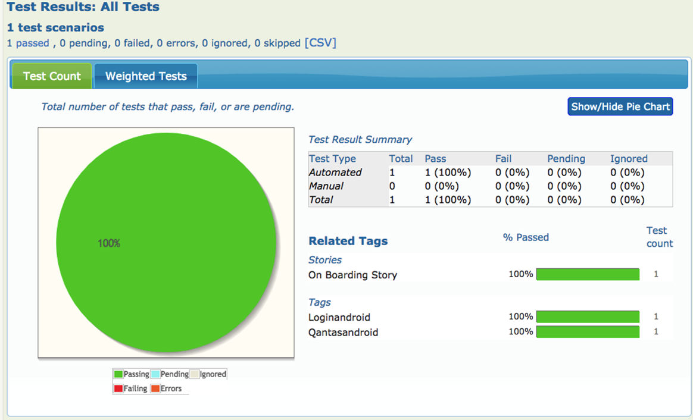

# Sample Appium - Java with AWS Device Farm Framework

## **Appium:**

Appium is an open-source tool for automating native, mobile web, and hybrid applications on iOS mobile, Android mobile, and Windows desktop platforms. Native apps are those written using the iOS, Android, or Windows SDKs. Mobile web apps are web apps accessed using a mobile browser (Appium supports Safari on iOS and Chrome or the built-in 'Browser' app on Android). Hybrid apps have a wrapper around a "webview" -- a native control that enables interaction with web content.

Importantly, Appium is "cross-platform": it allows you to write tests against multiple platforms (iOS, Android, Windows), using the same API. This enables code reuse between iOS, Android, and Windows testsuites.

Key Advantages of Appium are :

1.  It’s an open source tool.
2.  Support for both stages Android as well as iOS.
3.  Handles simulators/emulators and real devices.
4.  Underpins automation of Hybrid, Native and Webapps.
5.  Include Native libraries such as UIAutomator or XCUI in your tests.
6.  Underpins the vast majority of the programming languages like Java, Ruby, Python, C\#, etc.

## **AWS Device farm:**

Device Farm is an app testing service that you can use to test and interact with your Android, iOS, and web apps on real, physical phones and tablets that are hosted by Amazon Web Services (AWS).

There are two main ways to use Device Farm:

-   Automated testing of apps using a variety of testing frameworks.

-   Remote access of devices onto which you can load, run, and interact
    with apps in real time.

There are about 300 devices running in different operating system versions, different screen sizes , different manufactures using AWS Device farm. Leveraging device farm gives a massive boost in device coverage.

## **Sample project :Qantas Mobile App E2E framework:**

[Link to Repository](https://stash.qcpaws.qantas.com.au/projects/AMS04-A868/repos/qantas_app_e2e_tests/browse)

This is a reusable dynamic test automation framework for automating test scripts on Mobile Applications. The framework is coupled with open source options such as Appium, Serenity and JUnit, Bringing in a BDD(Behaviour Driven Development) Style to test scripts.

Appium is used a mediation layer whilst UIAutomator(Android) and XCUI(Swift) commands are sent to perform actions on Device Under Test. The framework is designed in way that any new libraries could be accommodated in the framework with  minimal changes to tests
component.  

Finally, The framework also provides a provision of generating test packages for running tests against variety of devices in AWS device farm.

## **How to write your tests**

1. Based on the page of the application, Create a \*.yml file in support/pages.  
  
2. Write a unique keyword, followed by type and element. Type here is type of identifier you want to use such as accessibilityid, name, xpath etc , element will be the value of the identifier.  
  
3. Create a page class extending to locator and methods using the key in yaml. This approach nullifies the need to change any class files. Any future change in identifiers can just be handled in yaml files.  
  
4. Create an Action class to perform different actions on the page object.  
  
5. Create step definitions using the action methods.  
  
6. Create tests for ios and Android using the step defs.

### Running your tests in local devices/simulators/emulators

Start appium using pre-launch as:  
  
iOS:  
```
appium --pre-launch --platform-name ios --platform-version xxx --udid xxxx --app \~/xxx.app --device-name xxx  
```
  
Android:  
```
appium --pre-launch --platform-name android --platform-version xxx--device-name xxx --app \~/xxx.apk  
```

Details of server arguments can be found [here](https://appium.io/slate/en/master/\#appium-server-arguments).  
  
Run the tests using :  

```  
mvn clean verify -Dtags=loginAsGuestSample 

-Dtags -&gt; The story / scenarios / features which are tagged and need to be run 

-DresetOption(optional)  
```  

This optional property sets the reset capability to the driver. Supported values are fullReset and noReset. By default this property is set to noReset. If you need to do a fullReset(not recommended), set the value as "fullReset".

### Generating test package for AWS Device farm

**Pre-condition:**  
Based on the platform set local.properties (support/prop/local/local.properties) os.type as ios or android  

Based on the environment set local.properties(support/prop/local/local.properties) env.type as prod or stg.
  
Steps:  
  
1. Clean the packages and setup what tests are being executed. 
   
    ```
    clean package -Dos.type=ios -Dtest.type=travel 

    -Dos.type -&gt; The type of os against which tests to be run. Supported values for os.type are ios and android.  

    -Dtest.type-&gt; The squad names of the test to be executed. Values
    supported are : cx4, entertainment, loyalty/\*, travel, booking. 
    ```
    If all tests apart from loyalty to be executed then this parameter can be ignored. Loyalty is maintained as a unique suite.  

2. Test.zip will be produced in target. Upload the zip to AWS  . 
  

Some sample code to conclude the Appium framework:

**Serenity Junit Tests**

  

**Step Definitions**

  

  
  
**Serenity Report**

  

  
  
**AWS Device Farm iOS Results**

  
  

**AWS Device Farm Android Results**

  

