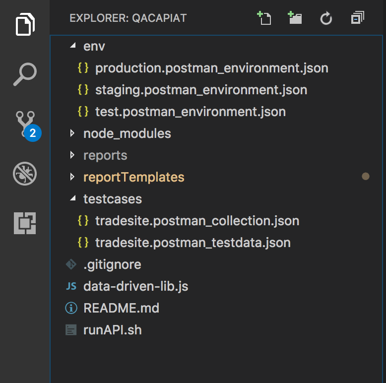

# Sample Postman Framework

Postman & Newman based framework aims for both API manual and automated
testing. Undoubtedly, Postman is the most-used rest API client
worldwide, designed from the ground up to support the API developer. In
Qantas, most teams already use Postman for API manual verification
purpose. All these tests are programmed in Postman client, reusable and
sharable. If we can use the same scripting for automation test, it will
definitely save big effort of creating and maintaining another
automation test suite built with a different tool sets like
rest-assured. 

{height="250"}

Newman is a command line collection runner for Postman. It allows you to
run and test a Postman Collection directly from the command line. It is
built with extensibility in mind so that you can easily integrate it
with your continuous integration servers and build systems.

Newman maintains feature parity with Postman and allows you to run
collections just the way they are executed inside the collection runner
in the Postman app.

For more details about newman, please refer
to https://www.getpostman.com/docs/postman/collection\_runs/command\_line\_integration\_with\_newman.

# API Test Framework

This API test framework is currently used for Qantas Agent Connect
project and some other API projects. Code repo located in
Stash <https://stash.qcpaws.qantas.com.au/projects/AMS02-A977/repos/qacapiat/browse>.
The overview structure of API test framework is presented as below. It
has Newman lib and customised test report template embedded in the
project. 

{height="250"}

1.  env folder: Variable configurations in Json format for each
    environment. In qantas, usually 3 environments are used, test,
    staging and production.

2.  node\_modules: Newman lib located, it is used by NodeJS when run the
    build.

3.  reports folder: This is the test report folder. Once done a test
    build, all test reports in different formats will be generated in
    reports folder, including HTML test report, Junit test report.

4.  reportTemplates folder: Apart from standard Newman test report,
    another customised and more advanced test report is provided in this
    folder.
5.  testcases folder: Testcase Collection is stored here and test data
    as well. Very different from other test frameworks and environment
    variables, this test data is globally used for whole test. This
    settings is only needed once test project requires some global
    settings.
6.  runAPI.sh: Build script. Call this shell script from local machine
    or CI will trigger a test run. Environment and other settings are
    indicated in this build script. 

# Collaboration in API development

In API development domain, most developers are using postman to do
manual verification to self-validate their new APIs in development or
existing APIs might be affected. They do a lot in Postman but nothing
persists after done the development. By using this framework, we make it
much different. 

****How we are benefited?****

<table>
<colgroup>
<col style="width: 13%" />
<col style="width: 42%" />
<col style="width: 44%" />
</colgroup>
<thead>
<tr class="header">
<th>Benefits</th>
<th>In old way</th>
<th>In new way</th>
</tr>
</thead>
<tbody>
<tr class="odd">
<td>API Handover</td>
<td>because of document mistakes like parameter format, special characters or other problems, QA is not easy to build a call to new API and have to interact with developers for a few times.</td>
<td>It hands over executable test script, avoiding any communication misunderstandings in verbal or document.</td>
</tr>
<tr class="even">
<td>Full Regression</td>
<td>Developers only verify single API under development, and not confident with existing APIs might be affected.</td>
<td>Developers use entire API test suite to do full regression test before handover with less concern.</td>
</tr>
<tr class="odd">
<td>Share Knowledge</td>
<td>Developers somehow do randomly manual verification against APIs.</td>
<td>Developers have a chance to learn how QAs write rich validations and reuse the scripting for further development.</td>
</tr>
<tr class="even">
<td>Unnecessary Duplication</td>
<td>Everyone involved in API development, uses Postman create API calls from scratch again and again.</td>
<td>One API one call, everyone uses the same code base.</td>
</tr>
</tbody>
</table>

  

**How we collaborate?**

Developer:

1.  When kick-off a new API, checkout the latest code in master branch
    of the test project
2.  Create a feature branch in test project for your new API
3.  Import test environment and test cases to Postman
4.  Add new API in imported test collection, with or without tests
    doesn't really matter
5.  Export new collection and any other changes to files
6.  Check-in and push your code changes to Stash

QAs:

1.  Checkout the feature branch handed over from developers
2.  Import tests to Postman
3.  Review tests of new APIs and updated APIs, including URL, Request
    Data
4.  Enrich tests of them if not enough validation
5.  Export changes and push to Stash
6.  Do manual exploratory test with Postman against new APIs and updated
    APIs
7.  If happy with everything, merge feature branch to Master

# How to setup new test project

1.  **Create a new project folder on your local machine**
2.  **Navigate to project folder through Command / Terminal**
3.  **Use git command to clone an existing project to local**  
    command: git
    clone https://\*\*\*\*\*\*@stash.qcpaws.qantas.com.au/scm/ams02-a977/qacapiat.git
4.  **Remove git element from project**  
    Remove .git sub folder from your project. It is a hidden folder so
    please make sure it is visible before any action through no matter
    GUI or Commandline.
5.  **Transfer your Postman tests to Newman Automation**  
    Export test cases: Open Postman client → Select test collection →
    Export as Collection V2.1 → Save new or replace the test collection
    in 'testcases' folder.  
    Export environment settings: Open Postman client → Select Manage
    Environments → Download Environment → Save new or replace the
    environment json file in 'env' folder.
6.  **Update build script for your project**  
    Open runAPI.sh and update test case and test data file name with the
    one in your project. 
7.  **Push to your project repository**  
    1.  Initialize project by running the following commands  

            git init
            git add --all
            git commit -m "Initial Commit" 

          

    2.  Push your files to the repository by running the following
        commands

            git remote add origin https://username@your.bitbucket.domain:7999/yourproject/repo.git 
            git push -u origin master

# How to RUN TEST

In the home folder of test project, a shell script file named runAPI.sh
can be found. It is the build script for API test project and the core
of the build is only one line of command starting with
'./node\_modules/newman/bin/newman.js run'. Each test project should
have its own build script with appropriate test case and environment
file indicated.

{height="250"}

**Run on local machine**:

1.  Open Command / Terminal and goto project folder
2.  Change runAPI.sh to executable if needed
3.  Execute runAPI.sh

**Run on Bamboo**:

1.  Goto build plan
2.  Configure plan including script, junit parser and variables
    referring to an existing project  
    {height="250"}

# Test Report

After a test run, test reports in a few formats will be produced in
reports folder. HTML report is basically used for test report purpose. 

{height="250"}

{height="250"}

*Note: When create a new build plan in CI, remember to publish html
report as an artifact.*

# Related Projects

-   **Project: QANTAS AGENCY CONNECT                Team:
    Supernova  **  
    Stash: <https://stash.qcpaws.qantas.com.au/projects/AMS02-A977/repos/qacapiat/browse>  
    Bamboo: <https://bamboo.qantas.com.au/browse/AMS02-A977S01CI>

## Attachments:

{width="8" height="8"}
[image2018-12-6\_11-45-40.png](attachments/119671083/119671084.png)
(image/png)  
{width="8" height="8"}
[image2018-12-6\_11-45-12.png](attachments/119671083/119671085.png)
(image/png)  
{width="8" height="8"}
[image2018-2-5\_13-48-57.png](attachments/119671083/119671086.png)
(image/png)  
{width="8" height="8"}
[image2018-2-5\_13-47-52.png](attachments/119671083/119671087.png)
(image/png)  
{width="8" height="8"}
[image2018-2-5\_13-42-1.png](attachments/119671083/119671088.png)
(image/png)  
{width="8" height="8"}
[image2018-2-5\_13-35-44.png](attachments/119671083/119671089.png)
(image/png)  
{width="8" height="8"}
[image2018-2-5\_12-59-19.png](attachments/119671083/119671090.png)
(image/png)  
{width="8" height="8"}
[image2018-1-24\_15-6-1.png](attachments/119671083/119671091.png)
(image/png)  
{width="8" height="8"}
[image2018-1-31\_14-18-47.png](attachments/119671083/119671092.png)
(image/png)  
{width="8" height="8"} [image2015-8-24
15:23:42.png](attachments/119671083/119671093.png) (image/png)  
