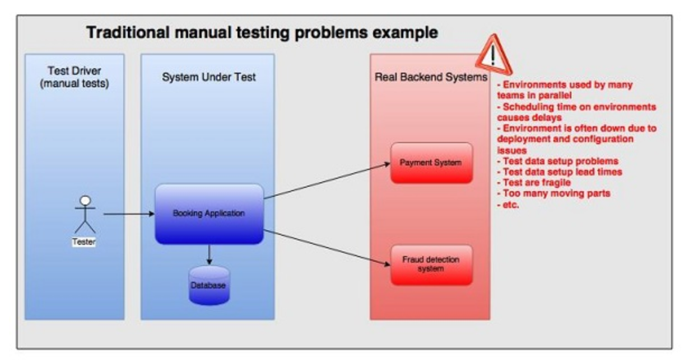
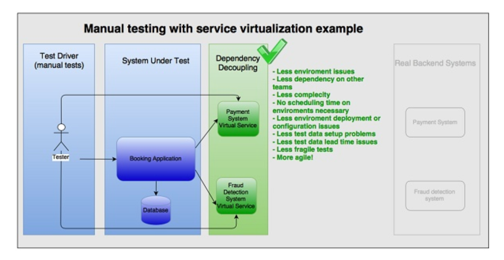

### Stubs, Mocks and Service Virtualization

**Service virtualization** is a technique for decoupling a test suite from environmental dependencies. It is part of the broader category of "test doubles" that includes mocks and stubs. There are many tools that support either service virtualization or two very similar approaches: stubbing and mocking. Let us look at a comparison of the three approaches, their relative strengths and explore a number of real world situations to recommend which technique may offer the most benefit. The intent is to provide an understanding of all three techniques that enables the team to choose the best option between a mock, stub, or virtual service depending on the situation.

#### Where and when do stubbing, mocking and service virtualization apply?

Let us have a look at three examples that can help us in understanding the concepts better.

The first one is a scenario where the testing team is testing the system manually. The system is connected to backend systems that are used by many teams for testing purposes. The tests are very fragile since there are many moving parts. The environments where the backend systems are deployed, are often down because of environment and deployment issues. Setting up test data in the backend systems may take days or weeks and is prone to errors. The testing team is often waiting for the systems or test data to become available. If you are a tester, you are often frustrated because you cannot do your job effectively. If you are a manager, you are frustrated because the team spends much of their time blocked by external dependencies. On top of that, you may spend a great deal of money setting up test data and paying for test transactions to an external third party API.

One way of solving the issues of too many dependencies and too many moving parts is by doing system testing before integration testing with external backend systems. Using virtual services or stubs, allows the team to decouple the testing from the real backend systems. The problems mentioned above, either disappears or loses priority. People are happy for a while.

Eventually, there will be other bottlenecks in the testing process. If you are a tester, you want to start writing automated tests and automate the repeatable daily activities. This lets you focus on what you are best at, creative and critical thinking to test the system. As a manager, you encourage your testers to explore other ways of testing the system and look into automation. You decide to try one of the BDD frameworks, such as Cucumber and start using “over the wire” (remotely located and run) stubs and mocks. Unfortunately, the developers and testers have problems communicating, they seem to be using the same words but not getting to consensus. Also, the consultants that have joined recently, advertise service virtualization as a superior way compared to stubbing or mocking. What do developers mean when they use the word mock or stub? Let’s look at the differences between stubs, mocks and virtual services, and what might be causing the communication issues.

#### What is a test double?

A test double is an object that stands in for a real object in a test. A test double allows us to decouple the application from the dependencies when testing the system under test (SUT). You replace the dependency with an equivalent interface that allows you to exercise a given test case.

Common categories of test double used by developers:

* dummy object (a string “Qantas”)
* stub (a StubUserRepository class that always returns user object representing a male named Dev, age 32, living in India)
* spy (a SpyHttpResponse class that records all invocations of the onPost method)
* fake (a FakeDatabase class which persists to an in memory H2 database instead of the DB2 production ­system)
* mock (a dynamic proxy implementation of OrderObserver interface, implemented by Mockito and used in a unit test)

Common categories of a test double used for testing and quality assurance:

* stub (a servlet in a WAR file created using SoapUI and deployed to a remote Jetty instance)
* virtual service (an artifact created with a service virtualization tool and deployed to a remote shared virtual service environment)

#### Stubs, Mocks and Virtual Services

The most commonly used categories of test doubles are mocks, stubs and virtual services. 

**Stub**: a minimal implementation of an interface that normally returns hardcoded data that is tightly coupled to the test suite. It is most useful when the suite of tests is simple and keeping the hardcoded data in the stub is not an issue. Some stubs are handwritten; some can be generated by tools. A stub is normally written by a developer for personal use. It can be shared with testers, but wider sharing is typically limited by interoperability issues related to software platform and deployment infrastructure dependencies that were hardcoded. A common practice is when a stub works in-process directly with classes, methods, and functions for unit, module, and acceptance testing. Some developers will say that a stub can also be primed, but you cannot verify an invocation on a stub. Stubs can also be communicating "over the wire", for example HTTP, but some would argue that they should be called virtual services in that case.

**Mock**: a programmable interface observer, that verifies outputs against expectations defined by the test. It is frequently created using a third party library, for example in Java that is Mockito, JMock or WireMock. It is most useful when you have a large suite of tests and a stub will not be sufficient because each test needs a different data set up and maintaining them in a stub would be costly. The mock lets us keep the data set-up in the test. A mock is normally written by a developer for personal use but it can be shared with testers. However, wider sharing is typically limited by interoperability issues related to software platform and deployment infrastructure dependencies that were hardcoded. They most often work in-process directly with classes, methods, and functions for unit, module, and acceptance testing. Mock provides responses based on a given request satisfying predefined criteria (also called request or parameter matching). A mock also focuses on interactions rather than state so mocks are usually stateful. For example, you can verify how many times a given method was called or the order of calls made to a given object.

**Virtual service**: a test double often provided as a Software-as-a-Service (SaaS), is always called remotely, and is never working in-process directly with methods or functions. A virtual service is often created by recording traffic using one of the service virtualization platforms instead of building the interaction pattern from scratch based on interface or API documentation. A virtual service can be used to establish a common ground for teams to communicate and facilitate artifact sharing with other development teams as well as testing teams. A virtual service is called remotely (over HTTP, TCP, etc.) normally supports multiple protocols (e.g. HTTP, MQ, TCP, etc.), while a stub or mock normally supports only one. Sometimes virtual services will require users to authorize, especially when deployed in environments with enterprise-wide visibility. Service virtualization tools used to create virtual services will most often have user interfaces that allow less tech-savvy software testers to hit the ground running, before diving into the details of how specific protocols work. They are sometimes backed by a database. They can also simulate non-functional characteristics of systems such as response times or slow connections. You can sometimes find virtual services that provide a set of stubbed responses for given request criteria, and pass every other request to a live backend system (partial stubbing). Similar to mocks, virtual services can have quite complex request matchers, that allow to have one response returned for many different types of requests. Sometimes, virtual services simulate system behaviors by constructing parts of the response based on request attributes and data.

It is often difficult to definitely say which of the following categories a test double fits into. They should be treated as spectrums rather than strict definitions.

|   | Data Source | Data Coupling | Invocation Verification | Invocation Protocol | Created by | Used by |
| --- | ------------ | ------------ | ------------ | ------------ | ------------ | ------------ | 
|**Stub**| Hardcoded data or data set up by the test | Tightly coupled to the test suite data | Not used | Usually in the same process (JVM, .NET, YARV, etc.). Sometimes over IP such as HTTP or raw TCP protocols | DEVs and sometimes testers | DEVs and sometimes testers |
|**Mock**| Data set up by the test | Can be flexible, both tightly and loosely coupled to the test suite data | Used often | Usually in the same process (JVM, .NET, YARV, etc.). Sometimes over IP such as HTTP or raw TCP protocols | Mostly DEVs | DEVs and sometimes testers |
|**Virtual Service**| Recorded data (possibly manually modified after the recording) or hardcoded data. Sometimes responses are based on request data | Tightly coupled to the test suite data | Sometimes testers will look at the virtual service logs while doing testing | Always over a network layer. Often supports many protocols such as HTTP, MQ, FIX, etc | Mostly testers. Recently more often by developers when working in microservice architectures | Mostly testers. Recently more often by developers when working in microservice architectures |

#### What is service virtualization?

It is the practice of creating virtual services and sharing them between developers and testers within a team and across teams. Developers and testers working on the same product can use the same virtual service artifacts or even virtual services. Another example is test teams across a large enterprise using the same virtual service artifacts. It promotes communication between development and test teams across many departments. It also attempts to address the problem of duplicated efforts by creating stubs for the same APIs within a large organisation by many teams simultaneously, by establishing new communication channels between teams.

Stubs, mocks and service virtualization solve different problems. Some problems can be addressed by three of them - stubs, mocks and virtual services. Some problems should be addressed only with mocks and stubs. To highlight only a few of the most common concerns please have a look at the comparison below.

|   | Pros | Cons | When to Use it | When **NOT** to Use it |
| --- | ---- | ---- | ---- | ---- |
| **Mocking** | Many open source software tools are available, with much information available on techniques online | A tool for developers mainly. Testers do not use mocks often | All levels of testing, whilst remembering about the test boundaries and the SUT. If you are willing to learn how to use mocking it is always a good idea | A substantial level of technical background is often required |
| **Stubbing** | Open source software available, Easily accessible information available on techniques online | Tests are tightly coupled to the stub because of the hardcoded data | Use stubs when the test data needed is not complex. If the test data is complex, use mocks instead, so that all the setup is performed in the tests. If you are willing to learn how to use stubs it is a good idea | A moderate level of technical background is often required. Avoid using stubs with hardcoded data in large suites of acceptance tests with complex test data |
| **Service virtualization** | Easy to pick up, An all-in-one solution, Many protocols supported by most tools, Well tested tools, Can record traffic, Easy to share across the teams once the tools are established within the company | The tools are expensive, Some of the tools are sold to CXO level managers without proper consultation with specialists before the deal which results in poor user experience and fit, You couple the test to the data in the virtual service, same as in a stub, The market leader tools work in a shared virtual service environment model, which create dependencies between individuals and teams. | Large scale problems. Many APIs to stub out. People want to use it starting today. Simulating non-functional requirements such as response times and slow connections. Partial stubbing. | Agile teams in small to medium size companies where developers work in an agile manner and know how to create stubs and mocks themselves using the open source or dedicated tools, and share them with testers. Large enterprise solutions will usually only interfere with the agility of the teams. Avoid using in acceptance tests, it could result in too strong dependencies between the test suite and the virtual services. |

